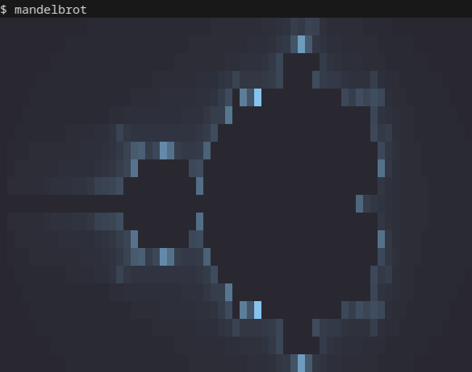
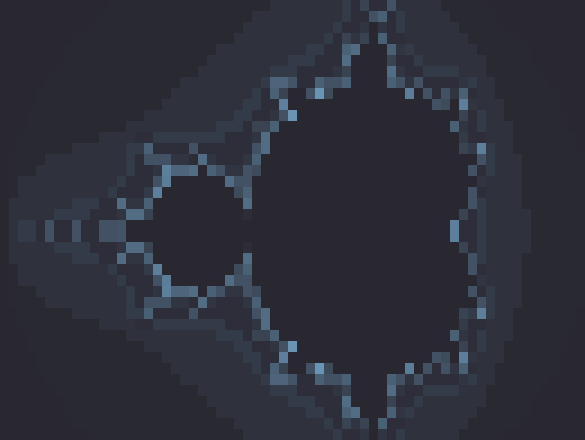

= Terminal Mandelbrot Visualizer

A CLI tool that generates colorful visualizations of the Mandelbrot set in your terminal using ANSI escape codes.

== Features

* Customizable colors
* Adjustable output dimensions
* Configurable view bounds
* https://en.wikipedia.org/wiki/Posterization[Posterization]
* Brightness adjustment

== Build

Build requires any D compiler

* https://dlang.org/download.html#dmd[DMD]
* https://gdcproject.org/downloads[GDC]
* https://github.com/ldc-developers/ldc#installation[LDC]

[source, bash]
----
# build executable
$ make

# install executable
$ sudo make install

# uninstall executable
$ sudo make uninstall
----

== Usage

----
mandelbrot [OPTIONS]

Arguments:
-x         --width Width of output
-y        --height Height of output
-f    --foreground Foreground color in hex
-b    --background Background color in hex
-p --posterization Set posterization level
-r          --root Set the nth root of the brightness level
-a        --bounds Set visible part of the fractal 'x0,y0,x1,y1'
-t         --ascii Only use ASCII characters
-q          --hash Hash brightness values
----

=== Examples

[source, bash]
----
mandelbrot -x 100 -y 60 -f 4040ff -b 080810
mandelbrot -p 15 -r 2
mandelbrot -a -1.5,-0.5,-0.75,0 -x 100 -y 80
----

== Gallery

[source, bash]
----
$ mandelbrot
----

[source, bash]
----
$ mandelbrot -x 100 -y 60 -f 4040ff -b 080810
----

[source, bash]
----
$ mandelbrot -p 18 -r 1.7 -q
----

